# Gatling Operator

  

[Gatling](https://gatling.io/) is an open source load testing tool that allows to analyze and measure the performance of a variety of services. [Gatling Operator](https://github.com/st-tech/gatling-operator) is a Kubernetes Operator for running automated distributed Gatling load testing.

## How Gatling Operator works

The desired state of a distributed Gatling load testing is described through a Kubernetes custom resource (`Gatling CR` in figure below). Based on Gatling CR, actions in the lifecycle of distributed Gatling load testing such as running load testing, generating reports, sending notification message, and cleaning up the resources are executed by relevant custom controller (`Gatling Controller` in figure below).

## Features

- Allows Gatling load testing scenario, resources, Gatling configurations files to be added in 2 ways:
  - Bundle them with Gatling runtime packages in a Gatling container
  - Add them as multi-line definition in Gatling CR
- Scaling Gatling load testing
  - Horizontal scaling: number of pods running in parallel during a load testing can be configured
  - Vertical scaling: CPU and RAM resource allocation for Gatling runner Pod can be configured
- Allows Gatling load testing to start running at a specific time
  - By default, the Gatling load testing starts running as soon as the runner Pod's init container gets ready. By specifing the start time, the Gatling load testing waits to start running until the specified time
- Gatling Pod attributions
  - Gatling runtime container image
  - [rclone](https://rclone.org/) container image
  - CPU and RAM resource allocation request and limit
  - `Affinity` (such as Node affinity) and `Tolerations` to be used by the scheduler to decide where a pod can be placed in the cluster
  - `Service accounts` for Pods
- Reports
  - Automated generating aggregated Gatling HTML reports and storing them to Cloud Storages such as `Amazon S3`, `Google Cloud Storage`, `Azure Blob Storage`. via [rclone](https://rclone.org/)
  - Allows credentials info for accessing the remote storage to be specified via Secret resource
- Notification
  - Automated posting webhook message and sending Gatling load testing result via notification providers such as `Slack`
  - Allows webhook URL info to be specified via Secret resource
- Automated cleaning up Gatling resources

## Requirements

- Kubernetes: version >= 1.18

> note: the versions below 1.18 might work but are not tested

## Quick Start

- [Quick Start Guide](docs/quickstart-guide.md)
## Documentations

- [Architecture](docs/architecture.md)
- [Gatling CRD Reference](docs/api.md)
- [User Guide](docs/user-guide.md)

## Contributing

Please make a GitHub issue or pull request to help us build the operator.

## Changelog

Please see the [list of releases](https://github.com/st-tech/gatling-operator/releases) for information on changes between releases.
