# Gatling Operator Architecture and Design

<!-- TOC -->

- [Gatling Operator Architecture and Design](#gatling-operator-architecture-and-design)
	- [Architecture Overview](#architecture-overview)
	- [Gatling Runner Pod as Multi Container Pod](#gatling-runner-pod-as-multi-container-pod)

<!-- /TOC -->

## Architecture Overview

The diagram below shows how Gatling Operator works in conjunction with Gatling Custom Resource (CR).
Based on Gatling CR, actions in the lifecycle of distributed Gatling load testing (such as running load testing, generating reports, sending notification message, and cleaning up the resources) are executed by relevant custom controller (`Gatling Controller` in figure below).

1. Create Gatling Runner Job
    - Gatling Runner Job runs Gatling Runner Pods in parallel. The parallelism field (`.spec.testScenarioSpec.parallelism`) specifies the maximum desired number of Pods the Job should run concurrently
    - The Gatling Runner Pod executes Gatling load testing scenario and uploads generated Gatling report file (`simulation.log`) to user-selected Cloud Storage (can be configured in `.spec.cloudStorageSpec`).
2. Create Gatling Reporter Job (Optional)
    - Once that the Gatling Runner Job is complete, Gatling Controller creates The Gatling Reporter Job if `.spec.generateReport` is set to true
    - Gatling Reporter Job runs Gatling Reporter Pod
    - Gatling Reporter Pod download all uploaded simulation.log on the Cloud Storage to its local filesystem, then generates an aggregated HTML report from the simulation.log(s) and upload the HTML report to the Cloud Storage
3. Post Webhook Message to Notification Service Provider (Optional)
    - Onece that all prior Jobs are complete, Gatling Controller posts webhook message to selected Notification Service Provider (can be configured in `.spec.notificationServiceSpec`) in order to notify Gatling load testing result
    - It's executed only if `.spec.notifyReport` is set to true
4. Cleanup all Gatling CR relevant resources (Optional)
    - Gatling Controller finally cleanup all Gatling CR related resources such as Jobs and Pods only if `.spec.cleanupAfterJobDone` is set to true

## Gatling Runner Pod as Multi Container Pod

Gatling Runner Pod runs multiple containers. The diagram below shows how those containers in each phase in Gatling Runner Pod works.

- gatling-waiter
  - Waits node scaling before starting to execute Gatling load testing scenario
  - In the case of running multiple Gatling Runner Pods, there is no guarantee that all Pods will be scheduled at the same timing. Thus, prior to the gatling-runner, gatling-waiter comes into play to achieve synchronization of the timing of all gatling-runners' execution by waiting for all Pods to be ready
- gatling-runner
  - Executes Gatling load testing scenario
  - Stores its generated report file (`simulation.log`) to an emptyDir volume
- gatling-result-transferer
  - Uploads the simulation.log file to to user-selected Cloud Storage (can be configured in `.spec.cloudStorageSpec`)

📝 It is noted that gatling-waiter and gatling-runner run as init containers and gatling-result-transferer as a main container in Gatling Runner Pod in the case of generating an aggregated Gatling result report. However it's also noted that gatling-waitner runs as an init container and gatling-runner run as a main container in the case of not generating the report.
