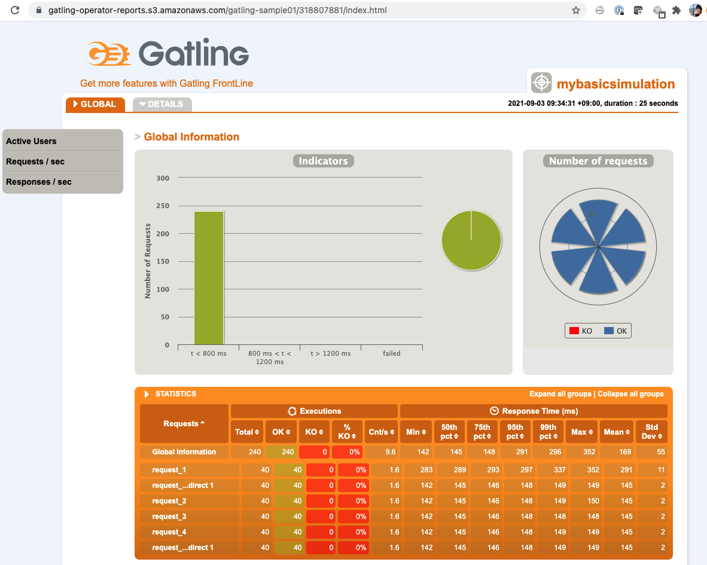
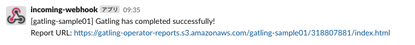

# Quick Start Guide

<!-- TOC -->

- [Quick Start Guide](#quick-start-guide)
	- [Prerequisites](#prerequisites)
	- [Create a Cluster](#create-a-cluster)
	- [Install Gatling Operator](#install-gatling-operator)
	- [Run your first load testing by deploying Gatling CR](#run-your-first-load-testing-by-deploying-gatling-cr)
	- [Configure Cloud Storage Provider for storing Gatling reports](#configure-cloud-storage-provider-for-storing-gatling-reports)
	- [Configure Notification Service Provider and notify Gatling load testing results via Slack](#configure-notification-service-provider-and-notify-gatling-load-testing-results-via-slack)

<!-- /TOC -->


The quick start guide helps to quickly deploy Gatling Operator and start a simple distributed load testing using Gatling Operator.

## Prerequisites

- Install [kubectl](https://kubernetes.io/docs/tasks/tools/) and [kind](https://kind.sigs.k8s.io/docs/user/quick-start/#installation)
- Clone the [gatling-operator](https://github.com/st-tech/gatling-operator) repository

## Create a Cluster
Create a cluster using kind.
1.18 or higher version is recommended for the Kubernetes cluster. Node Images for kind can be found in the [release notes](https://github.com/kubernetes-sigs/kind/releases).

```bash
kind create cluster
```

## Install Gatling Operator

```bash
kubectl apply -f https://github.com/st-tech/gatling-operator/releases/download/v0.5.0/gatling-operator.yaml
```

Expected output would be like this:

```bash
namespace/gatling-system created
customresourcedefinition.apiextensions.k8s.io/gatlings.gatling-operator.tech.zozo.com created
serviceaccount/gatling-operator-controller-manager created
role.rbac.authorization.k8s.io/gatling-operator-leader-election-role created
clusterrole.rbac.authorization.k8s.io/gatling-operator-manager-role created
rolebinding.rbac.authorization.k8s.io/gatling-operator-leader-election-rolebinding created
clusterrolebinding.rbac.authorization.k8s.io/gatling-operator-manager-rolebinding created
deployment.apps/gatling-operator-controller-manager created
```

All resources required for the Gatling operator, such as CRD and controller manager, are deployed using the command above. Now you're ready to deploy Gatling CR to run Gatling load testing.

The command above applies a Gatling Operator manifest of v0.5.0. Please change the version if necessary. You can check the version from the [Release page](https://github.com/st-tech/gatling-operator/releases).

## Run your first load testing by deploying Gatling CR

Deploy a sample Gatling CR, as well as all resources required for the Gatling CR in the repository.
```
kustomize build config/samples | kubectl apply -f -
```

Expected output would be like this:

```bash
serviceaccount/gatling-operator-worker unchanged
role.rbac.authorization.k8s.io/pod-reader unchanged
rolebinding.rbac.authorization.k8s.io/read-pods configured
secret/gatling-notification-slack-secrets unchanged
gatling.gatling-operator.tech.zozo.com/gatling-sample01 created
```


After deploying the Gatling CR, Gatling Controller creates a Gatling Runner job. The job then runs the Gatling Runner Pods to execute Gatling load test scenario in parallel.

```
$ kubectl get gatling,job,pod
```

Expected output would be like this:

```
NAME                                                      AGE
gatling.gatling-operator.tech.zozo.com/gatling-sample01   10s

NAME                                COMPLETIONS   DURATION   AGE
job.batch/gatling-sample01-runner   0/3           9s         9s

NAME                                READY   STATUS    RESTARTS   AGE
pod/gatling-sample01-runner-8rhl4   1/1     Running   0          9s
pod/gatling-sample01-runner-cg8rt   1/1     Running   0          9s
pod/gatling-sample01-runner-tkplh   1/1     Running   0          9s
```

You can also see from the Pod logs that Gatling is running.

```
kubectl logs gatling-sample01-runner-tkplh -c gatling-runner -f
```

Expected output would be like this:

```bash
Wait until 2022-02-25 06:07:25
GATLING_HOME is set to /opt/gatling
Simulation MyBasicSimulation started...

================================================================================
2022-02-25 06:08:31                                           5s elapsed
---- Requests ------------------------------------------------------------------
> Global                                                   (OK=2      KO=0     )
> request_1                                                (OK=1      KO=0     )
> request_1 Redirect 1                                     (OK=1      KO=0     )

---- Scenario Name -------------------------------------------------------------
[--------------------------------------------------------------------------]  0%
          waiting: 0      / active: 1      / done: 0
================================================================================


================================================================================
2022-02-25 06:08:36                                          10s elapsed
---- Requests ------------------------------------------------------------------
> Global                                                   (OK=3      KO=0     )
> request_1                                                (OK=1      KO=0     )
> request_1 Redirect 1                                     (OK=1      KO=0     )
> request_2                                                (OK=1      KO=0     )

---- Scenario Name -------------------------------------------------------------
[--------------------------------------------------------------------------]  0%
          waiting: 0      / active: 1      / done: 0
================================================================================


================================================================================
2022-02-25 06:08:40                                          14s elapsed
---- Requests ------------------------------------------------------------------
> Global                                                   (OK=6      KO=0     )
> request_1                                                (OK=1      KO=0     )
> request_1 Redirect 1                                     (OK=1      KO=0     )
> request_2                                                (OK=1      KO=0     )
> request_3                                                (OK=1      KO=0     )
> request_4                                                (OK=1      KO=0     )
> request_4 Redirect 1                                     (OK=1      KO=0     )

---- Scenario Name -------------------------------------------------------------
[##########################################################################]100%
          waiting: 0      / active: 0      / done: 1
================================================================================

Simulation MyBasicSimulation completed in 14 seconds
```

As configured in [the sample manifest](https://github.com/st-tech/gatling-operator/blob/85e69840274214c47e63f65a5c807dd541dff245/config/samples/gatling-operator_v1alpha1_gatling01.yaml#L6-L8), an aggregated Gatling HTML report is not created, nor a notification message is posted.

You can generate the Gatling HTML report by enabling `.spec.generateReport` flag and setting the `.spec.cloudStorageSpec`. Also you can posting the notification message by enabling `.spec.notifyReport` and setting `.spec.notificationServiceSpec`.

## Configure Cloud Storage Provider for storing Gatling reports

As a next step, let's generate the Gatling HTML reports for the Gatling load testing.

First of all, set `.spec.generateReport` in Gatling CR to `true` in order to generate an aggregated Gatling report. In addition, set `.spec.cleanupAfterJobDone` to `true` in order not to cleanup Gatling resources after the Gatling job done.

```yaml
apiVersion: gatling-operator.tech.zozo.com/v1alpha1
kind: Gatling
metadata:
  name: gatling-sample01
spec:
  generateReport: true                     # The flag of generating Gatling report
  generateLocalReport: false               # The flag of generating Gatling report for each pod
  notifyReport: false                      # The flag of notifying Gatling report
  cleanupAfterJobDone: true                # flag of cleanup Gatling resources after the job done
```

Then, configure Cloud Storage Provider for storing Gatling reports in `.spec.cloudStorageSpec`. In this case, let's store the reports to Amazon S3 bucket.
Suppose that you want to store the reports to a bucket named `gatling-operator-reports` of Amazon S3 located in `ap-northeast-1` region, configure each fields in `.spec.cloudStorageSpec` like this:

```yaml
apiVersion: gatling-operator.tech.zozo.com/v1alpha1
kind: Gatling
metadata:
  name: gatling-sample01
spec:
  cloudStorageSpec:
    provider: "aws"
    bucket: "gatling-operator-reports"
    region: "ap-northeast-1"
```

You might want to add more configurations in `.spec.cloudStorageSpec` for Gatling Pods to access the Amazon S3 bucket. It depends on S3 authentication methods you choose. Please check [Set Amazon S3 as Cloud Storage](user-guide.md#set-amazon-s3-as-cloud-storage) for more details.

📝 **Note**: There are multiple Cloud Storage Provider options. Currently `Amazon S3`, `Google Cloud Storage`, and `Azure Blob Storage` are supported. Please check [User Guide](./user-guide.md) for more details.

Once finish adding the Cloud Storage Provider configuration in the Gatling CR named `gatling-sample01`, deploy it and wait until it's done.

```bash
kustomize build config/samples | kubectl apply -f -
```

You can obtain the Gatling report URL (`reportUrl`) by checking `.status`.

```bash
kubectl get gatling gatling-sample01 -o jsonpath='{@.status}' |jq

{
  "reportCompleted": true
  "reportStoragePath": "s3:gatling-operator-reports/gatling-sample01/318807881"
  "reportUrl": "https://gatling-operator-reports.s3.amazonaws.com/gatling-sample01/318807881/index.html"
  "reporterJobName": gatling-sample01-reporter
  "reporterStartTime": 1631415671
  "runnerCompleted": true
  "runnerJobName": gatling-sample01-runner
  "runnerStartTime": 1631415570
  "succeeded": 5
}
```

Here is a sample Gatling HTML report:



Finally, cleanup the Gatling CR manually

```bash
kubectl delete gatling gatling-sample01
```


## Configure Notification Service Provider and notify Gatling load testing results via Slack

In this step, let's add Notification Service Provider configuration to the same Gatling CR named `gatling-sample01` in order to notify Gatling load testing results via Slack.

First of all, set `.spec.notifyReport` to `true` in order to enable Notification Service Provider.

```yaml
apiVersion: gatling-operator.tech.zozo.com/v1alpha1
kind: Gatling
metadata:
  name: gatling-sample01
spec:
  generateReport: true                     # The flag of generating Gatling report
  generateLocalReport: false               # The flag of generating Gatling report for each pod
  notifyReport: true                       # The flag of notifying Gatling report
  cleanupAfterJobDone: true                # flag of cleanup Gatling resources after the job done
```

Then, configure Notification Service Provider in `.spec.notificationServiceSpec` to notify Gatling load testing result via Slack. Suppose that you want to store credential info (Slack webhook URL) in Kubernetes Secret named `gatling-notification-slack-secrets`, you configure each fields in `.spec.notificationServiceSpec` like this:

```yaml
apiVersion: gatling-operator.tech.zozo.com/v1alpha1
kind: Gatling
metadata:
  name: gatling-sample01
spec:
  notificationServiceSpec:
    provider: "slack"
    secretName: "gatling-notification-slack-secrets"
```

You need to set Slack webhook URL value (in base64 encoded string) in the Secret for a Slack channel to which you want to deliver the message. The key name for the Slack webhook URL must be `incoming-webhook-url`.

```yaml
apiVersion: v1
data:
  incoming-webhook-url: <base64 encoded Webhook-URL string>
kind: Secret
metadata:
  name: gatling-notification-slack-secrets
type: Opaque
```

Once finish adding the Notification Service Provider configuration in the Gatling CR named `gatling-sample01`, deploy it again in the same way you did previously and wait until it's done.

```bash
kustomize build config/samples | kubectl apply -f -
```

You'll get a Slack message like this:



Please check [User Guide](./user-guide.md) for more details on Gatling CR configurations.
